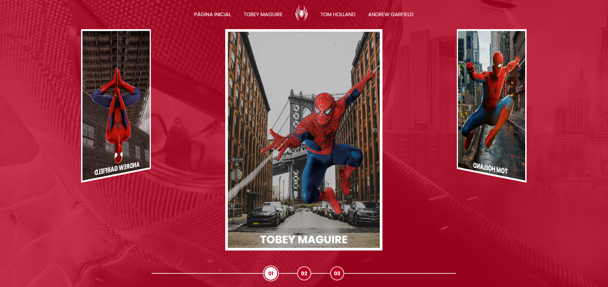
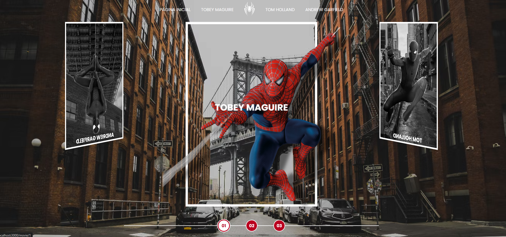
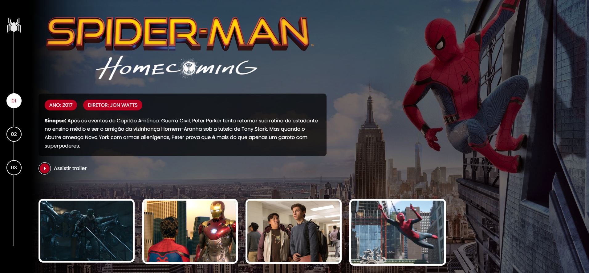
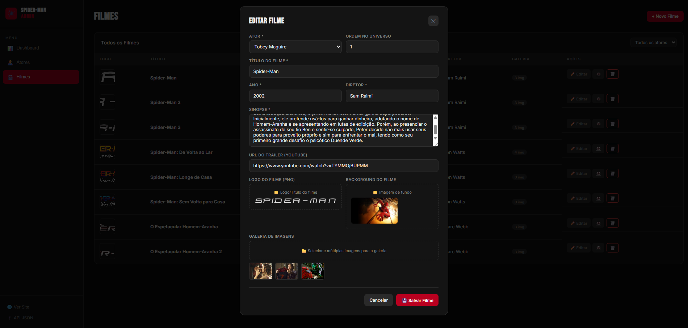

# 🕷️ Spider-Man Multiverses

Projeto desenvolvido durante curso da [DIO](https://www.dio.me/), evoluído com backend **Node.js**, **API REST** e **painel administrativo** completo.

O site apresenta os três universos do Homem-Aranha — Tobey Maguire, Tom Holland e Andrew Garfield — em um carrossel 3D interativo, com páginas individuais para cada filme.

---

## 🖥️ Preview

| Página Inicial | Filme | Admin |
|---|---|---|
| Carrossel 3D com os 3 universos | Sinopse, galeria e trailer | Gerenciar atores e filmes |

---

## 🚀 Tecnologias

**Frontend**
- HTML5, CSS3, JavaScript (ES6+)
- Fancybox 4 (galeria de imagens)

**Backend**
- Node.js
- Express 5
- lowdb (banco de dados JSON)
- Multer (upload de imagens)
- CORS

---

## 📁 Estrutura do Projeto

```
spiderman/
├── server.js                    # Servidor Express + rotas da API
├── package.json
├── data/
│   ├── db.js                    # Configuração e seed do banco
│   └── db.json                  # Banco de dados (gerado automaticamente)
├── uploads/                     # Imagens enviadas pelo admin
└── public/
    ├── index.html               # Página inicial — carrossel 3D
    ├── movie.html               # Página do filme — dinâmica
    ├── admin.html               # Painel administrativo
    └── assets/
        ├── css/
        │   ├── reset.css
        │   ├── global.css
        │   ├── home-page-styles.css
        │   ├── internal.css
        │   ├── admin.css
        │   └── components/
        │       ├── _navigator.css
        │       ├── _gallery.css
        │       ├── _pills.css
        │       └── _link-button.css
        ├── scripts/
        │   ├── script.js        # Carrossel (hover + rotação)
        │   ├── home.js          # Lógica da página inicial
        │   ├── movie.js         # Lógica da página do filme
        │   └── admin.js         # Lógica do painel admin
        └── images/
```

---

## ⚙️ Como rodar localmente

**Pré-requisitos:** [Node.js](https://nodejs.org) instalado (versão LTS recomendada)

```bash
# 1. Clone o repositório
git clone https://github.com/cludtke/spiderman.git

# 2. Entre na pasta
cd spiderman

# 3. Instale as dependências
npm install

# 4. Inicie o servidor
npm start
```

Acesse no navegador:

| Página | URL |
|---|---|
| 🌐 Site | http://localhost:3000 |
| ⚙️ Admin | http://localhost:3000/admin |
| 🔌 API | http://localhost:3000/api/movies |

---

## 🔌 API REST

### Atores

| Método | Rota | Descrição |
|---|---|---|
| `GET` | `/api/actors` | Lista todos os atores |
| `GET` | `/api/actors/:slug` | Retorna ator com seus filmes |
| `POST` | `/api/actors` | Cria novo ator |
| `PUT` | `/api/actors/:id` | Edita ator |
| `DELETE` | `/api/actors/:id` | Remove ator e seus filmes |

### Filmes

| Método | Rota | Descrição |
|---|---|---|
| `GET` | `/api/movies` | Lista todos os filmes |
| `GET` | `/api/movies/:id` | Retorna um filme |
| `POST` | `/api/movies` | Cria novo filme |
| `PUT` | `/api/movies/:id` | Edita filme |
| `DELETE` | `/api/movies/:id` | Remove filme |

### Upload

| Método | Rota | Descrição |
|---|---|---|
| `POST` | `/api/upload` | Envia uma imagem |

---

## ⚙️ Painel Admin

Acesse em `http://localhost:3000/admin`

- **Dashboard** — visão geral com contagem de atores, filmes e imagens
- **Atores** — adicionar, editar e remover atores do carrossel
- **Filmes** — adicionar, editar e remover filmes com upload de logo, background e galeria
- Tudo sem precisar tocar no código ou no banco de dados

---

## 🗄️ Banco de Dados

O projeto usa **lowdb** — banco de dados em arquivo JSON, sem instalação adicional.

O arquivo `data/db.json` é gerado automaticamente na primeira execução, já com todos os filmes cadastrados.

> Para resetar os dados, apague o arquivo `data/db.json` e reinicie o servidor.

---

## 📌 Origem do Projeto

Projeto iniciado no bootcamp da [DIO](https://www.dio.me/) e evoluído com:
- Migração do frontend estático para arquitetura cliente-servidor
- Criação de API REST completa com Node.js + Express
- Banco de dados com persistência em JSON
- Painel administrativo para gerenciamento de conteúdo
- Organização do código: CSS em arquivos próprios, JS separado por página






